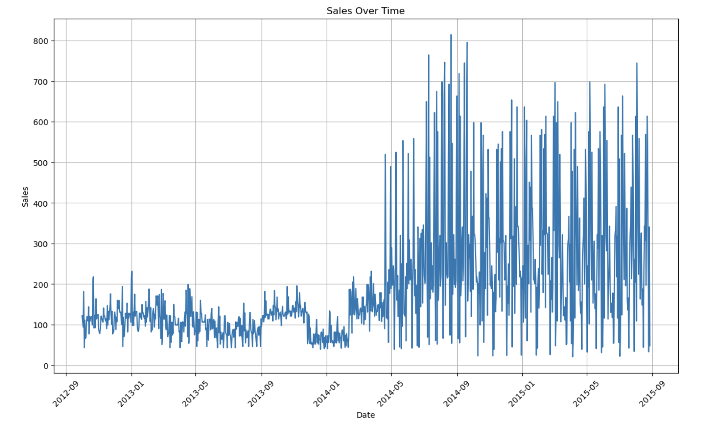
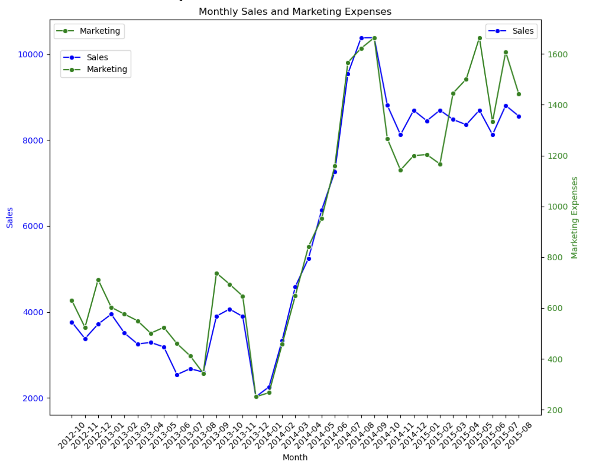
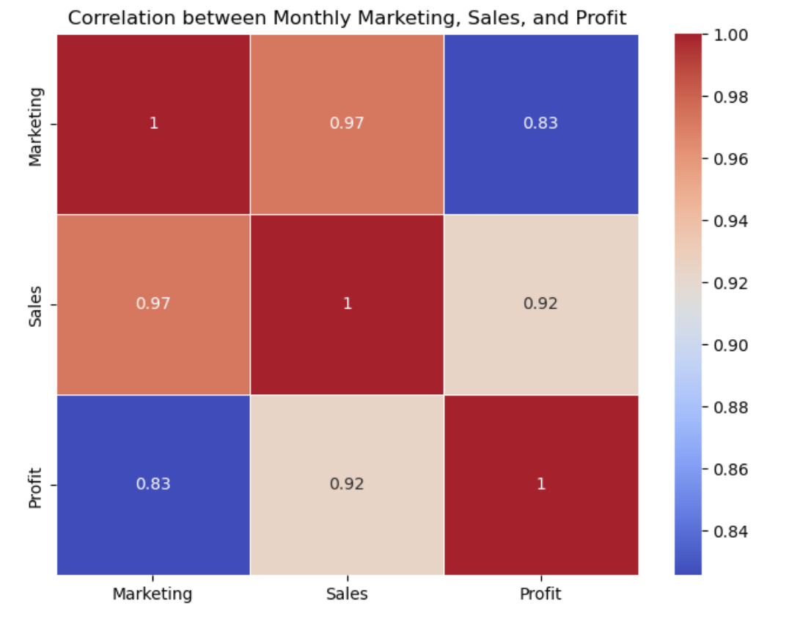
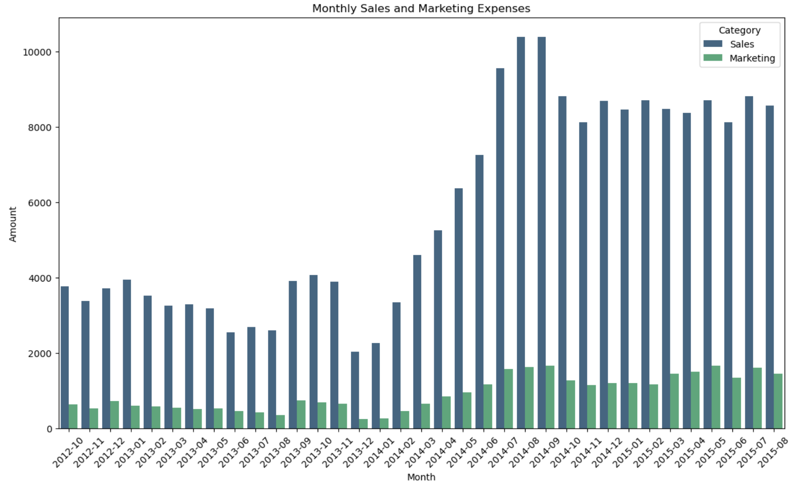
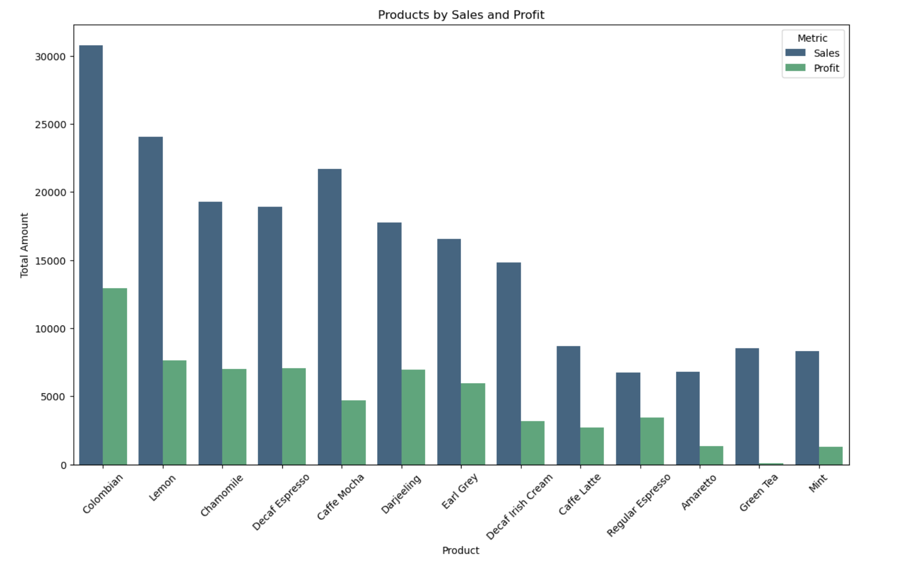
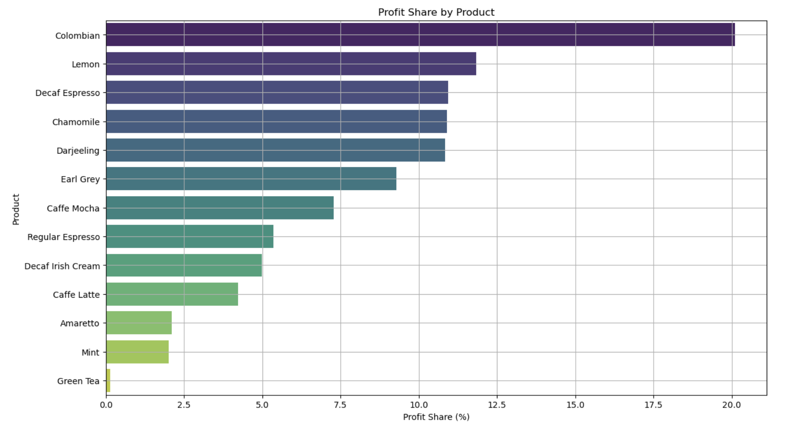
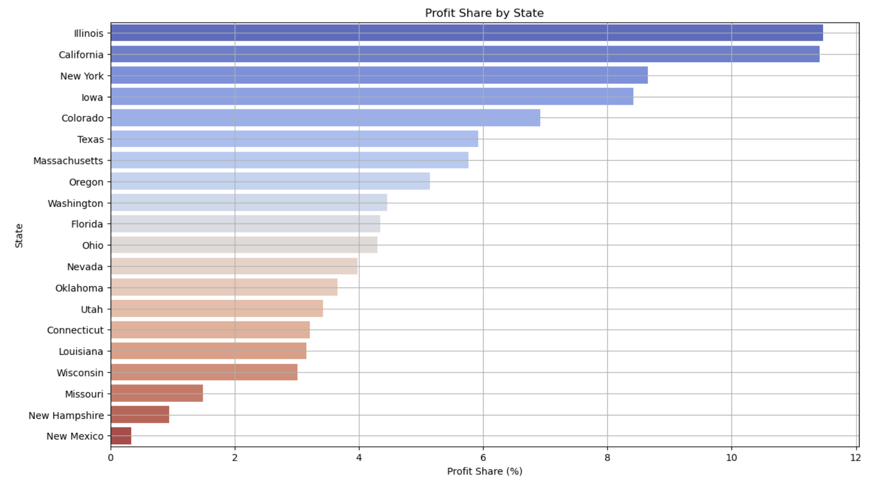
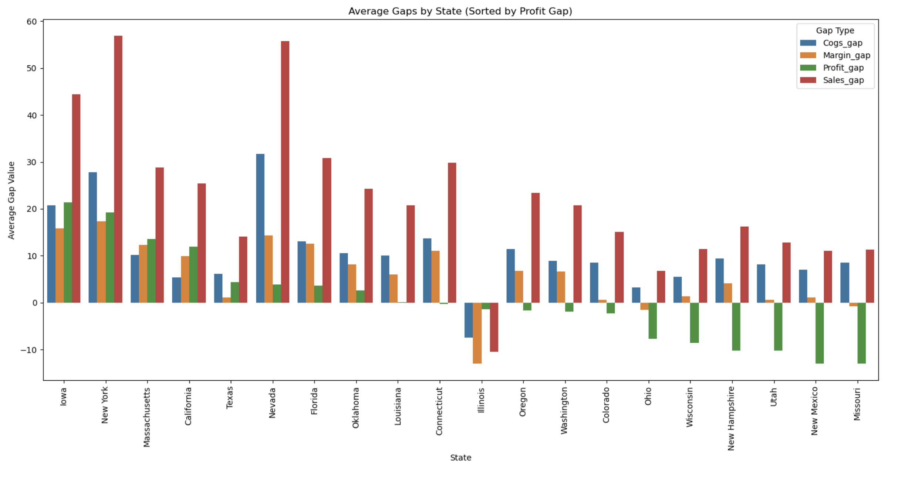

# ☕ Coffee Chain Sales Analysis

## Project Overview

This project presents an exploratory data analysis (EDA) of a coffee chain's sales data.  
The goal of the analysis is to better understand business performance, marketing impact, and profitability across products and states.

The project focuses on identifying patterns in:

- Sales growth over time
- The relationship between marketing and revenue
- Product profitability
- Geographic distribution of profit
- Operational performance gaps

The analysis was conducted using **Python**, primarily with the following libraries:

- Pandas
- NumPy
- Matplotlib
- Seaborn

---

# 📈 Sales Over Time

The following visualization shows how sales evolved throughout the analyzed period.

Key observations:

- Early periods show relatively stable sales.
- Around 2014 there is a noticeable growth trend.
- Later periods show higher volatility, which may indicate increased activity or expansion.

---

# 📊 Monthly Sales vs Marketing Expenses

This visualization compares monthly sales with marketing expenses.

Insights:

- Sales tend to increase when marketing spending rises.
- Marketing investment appears to drive sales growth.
- The relationship is strong but not perfectly linear.

---

# 🔗 Correlation Between Marketing, Sales, and Profit

To better understand how the main variables relate to each other, a correlation analysis was performed.

Key findings:

- **Marketing and Sales** show a very strong correlation (~0.97)
- **Sales and Profit** also have a strong correlation (~0.92)
- **Marketing and Profit** maintain a strong relationship (~0.83)

This suggests that marketing activities have a meaningful impact on overall business performance.

---

# 📅 Monthly Sales and Marketing Overview

The following chart presents monthly values for both sales and marketing spending.

Observations:

- Both marketing and sales grow significantly during later periods.
- In some months sales increase faster than marketing expenses, indicating improved efficiency.

---

# 🛍️ Products by Sales and Profit

This visualization compares total **sales and profit across products**.

Main insights:

- **Colombian coffee** is the top performing product.
- **Lemon** and **Caffe Mocha** are also strong contributors.
- Some products generate good sales but lower profit margins.

---

# 🧾 Profit Share by Product

This chart illustrates the distribution of profit across different products.

Key insights:

- A small group of products generates a large portion of total profit.
- The profit distribution follows a typical concentration pattern.
- Some products contribute only a small fraction of total profit.

---

# 🌎 Profit Share by State

This analysis explores the geographic distribution of profit.

Key observations:

- **Illinois and California** generate the largest share of profit.
- **New York and Iowa** also contribute significantly.
- States such as **New Mexico and New Hampshire** contribute much less.

This suggests regional differences in market performance.

---

# ⚙️ Operational Gaps by State

The following chart compares average gaps between several financial metrics:

- COGS gap
- Margin gap
- Profit gap
- Sales gap

Insights:

- Some states show large differences between sales and profit.
- These gaps may indicate operational inefficiencies.
- Other states demonstrate balanced performance.

---

# 🔍 Key Insights

From the analysis we can conclude:

- Marketing investment has a strong relationship with sales performance.
- Sales have increased significantly over time.
- A small number of products drive the majority of profits.
- Profit distribution varies across geographic regions.
- Some states show operational gaps that may indicate opportunities for improvement.

---

# 🛠 Technologies Used

- Python
- Pandas
- NumPy
- Matplotlib
- Seaborn
- Jupyter Notebook

